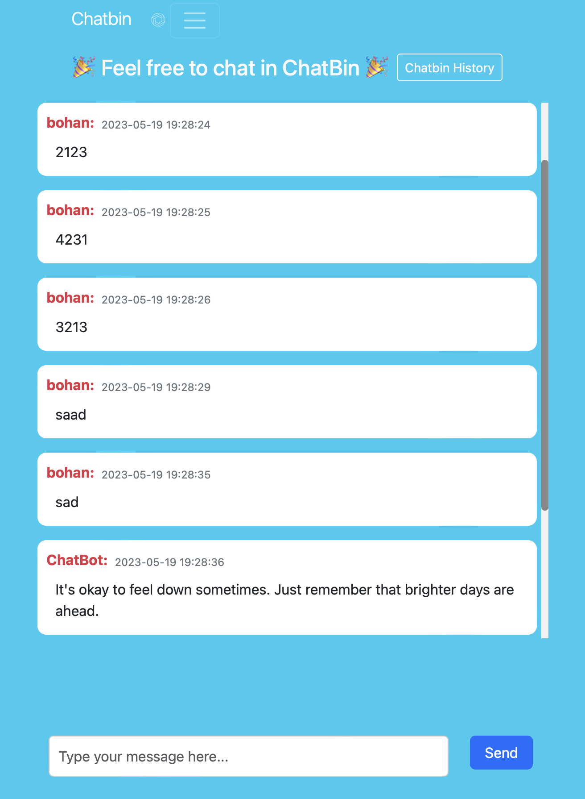
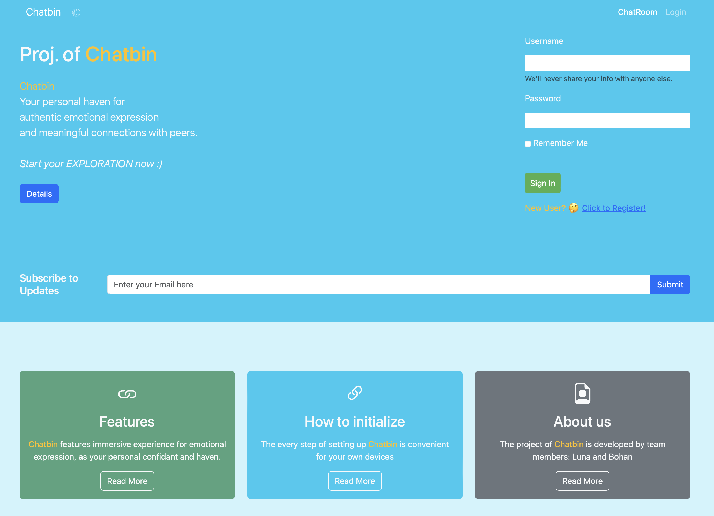
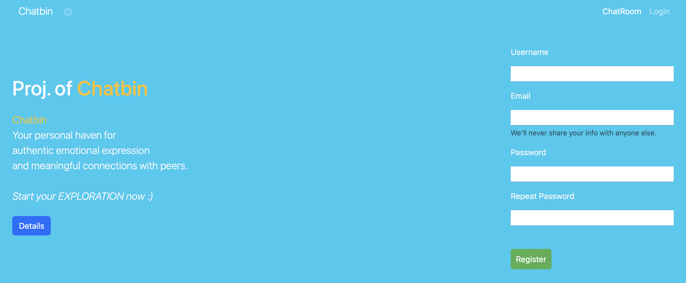
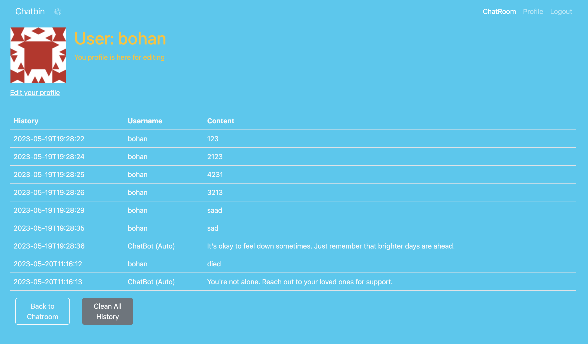
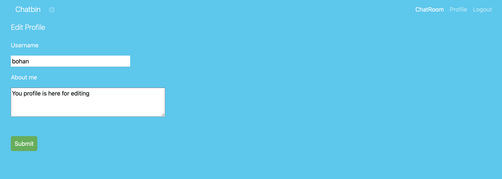
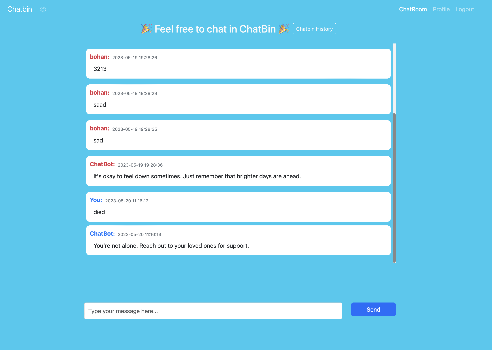
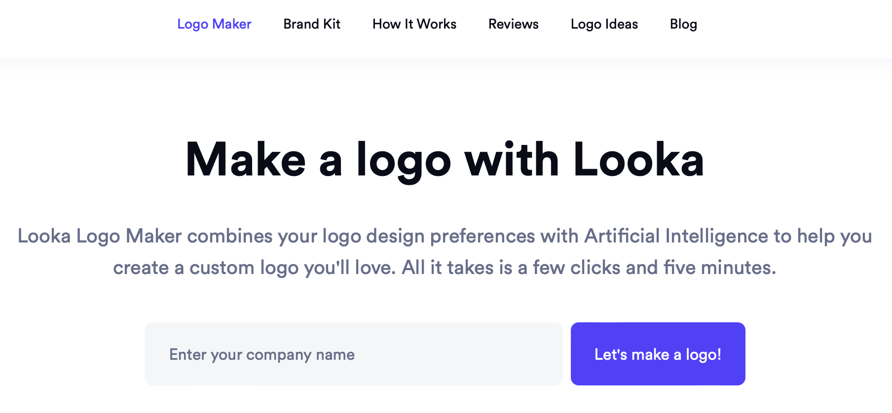
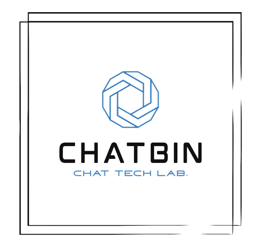

# Details for Project 2 Chatbin

_Chatbin, Your personal haven for authentic emotional expression and meaningful connections with peers._

## Part 1: Functions and Features of Chatbin

### Responsive Design

Chatbin is a responsive web application that can be used on different devices thanks to its bootstrap 5 framework and customised css styles.

### Index Page (Login Page)

Index Page is the entry point of the application. It is the page where users can login to their accounts or register for a new account. In addition, four modals are added to the index page to provide users with more information about Chatbin.

### Register Page

Register Page is where users can create a new account. It is a form that takes in the user's username, email and password. The password is hashed and stored in the database.

### Profile and History Page

Profile Page is where users can view their profile information and update their profile picture. History Page is where users can view their chat history with Chatbin.

Users can edit the profile when clicking on the edit_your_profile link

### Chat Page

Chat Page is where users can chat with Chatbin. User's messages and the conversation will be displayed on the chat page. The scroll bar will automatically scroll to the bottom of the page when the page is loaded or when a new message is sent.

Additionally, customised Chatbot is used to respond to the user's negative messages by detecting key words.

## Part 2: How to initialize this app?

1. `python3 -m venv venv`
   Create a virtual environment under the main directory (CITS5505_Project2).
   And then you can find a new folder called 'venv' under the main directory.
2. `source venv/bin/activate`
   Activate the virtual environment.
3. `pip install -r requirements.txt`
   This is to install all dependencies for this application
4. `flask shell`
   Enter python terminal in the virtual environment
5. `flask db init`
   Create the migration repository for chatbin
6. `flask db migrate -m "users table"`
   With the migration repository in place, it is time to create the first database migration, which will include the users table that maps to the User database model.
   The `flask db migrate` sub-command generates these automatic migrations.
7. `flask db upgrade`
   The flask db migrate command does not make any changes to the database, it just generates the migration script. To apply the changes to the database, the flask db upgrade command must be used.
8. `export FLASK_APP=chatbin.py`
   Before running it, though, Flask needs to be told how to import it, by setting the FLASK_APP environment variable.
9. Use Ctrl + C to exit the python terminal
10. `flask run`
    Now the app is running on 127.0.0.1/5000

## Part 3: How to test this app?

### `tests/unit_test.py` is to do some basic unit tests.

### Usage:

1. First, modify a line in the **init**.py
   `app.config.from_object('config.TestingConfig')`
2. Then, run the following code in the termianl:
   `python3 -m unittest tests.unit_test`

### `tests/system_test.py` uses Selenium to automate browsers to run some user tests.

### Usage:

1. First, modify a line in the **init**.py
   `app.config.from_object('config.TestingConfig')`
2. Then, run the following code in the termianl:
   `python3 -m tests.system_test`

## Part 4: Logo Design & About us

### Logo Design

Looka: https://looka.com/logo-maker/?gclid=CjwKCAjwvJyjBhApEiwAWz2nLW_OWMM106prm-kNE3snXwWkpkW-nP7hAD4aYgiyweR9cHK44FeU6BoCeesQAvD_BwE
a free logo maker website, is used to create our logos. Additionally, we remove the background of the logos.

### Different Logos

Regular and large size logos:

### Team Info 😆

We are a two-member team of CITS5505, and the team menbers are Luna and Bohan :)

## Part 5: Files Navigation

### Python files

1. `chatbin.py` (Entry point to start the Flask application)
2. `config.py` (Configuration file for the application)
3. `app/__init__.py` (Initialize the Flask application and database)
4. `app/models.py` (Define the database models with class User and class Message)
5. `app/routes.py` (Define the routes to template pages)
6. `app/forms.py` (Define the LoginForm, RegistrationForm, and EditProfileForm classes as subclasses of FlaskForm)

### Templates

1. `app/templates/base.html` (A base template)
2. `app/templates/register.html` (HTML template for the register page)
3. `app/templates/index.html` (HTML template for the home page (login page))
4. `app/templates/user.html` (HTML template for the user profile and history page)
5. `app/templates/edit_profile.html` (HTML template of edit_profile page for logged-in users)

### Static

1. `app/static`(Javascripts, css, jquery, favicon, and logo)
